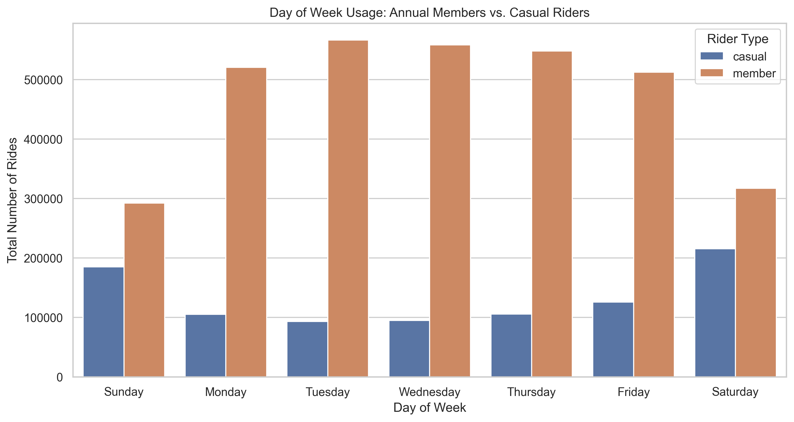
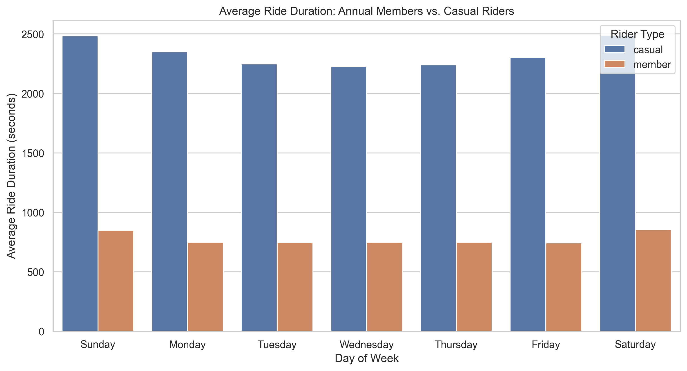
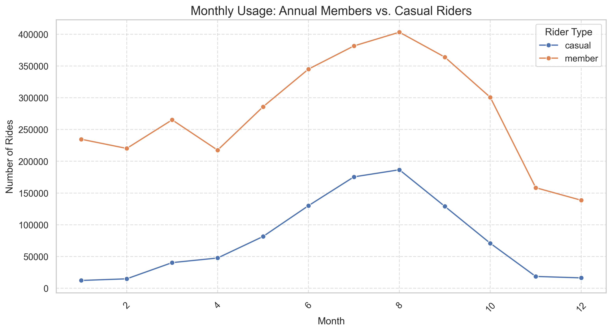
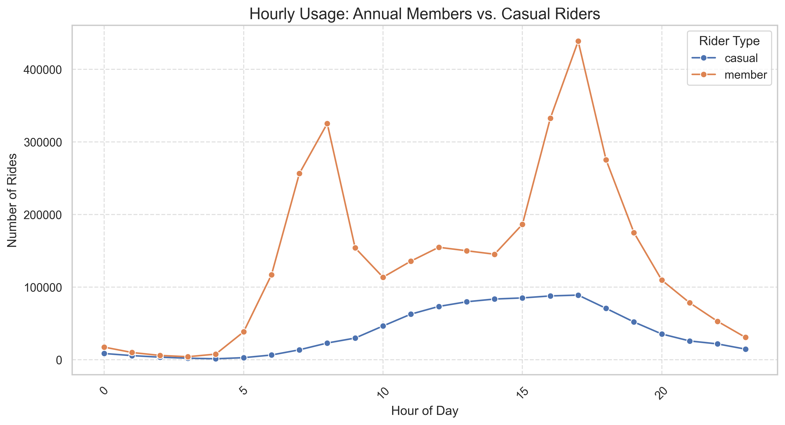
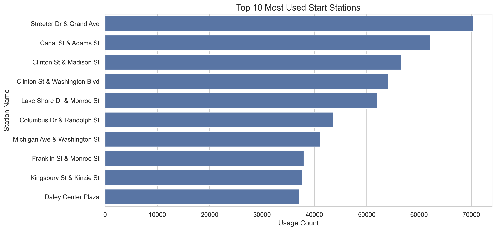

# Cyclistic Bike-Share: Behavioral Analysis & Membership Conversion Strategy

## 📝 Project Overview
This project serves as a comprehensive data analysis case study exploring the behavioral differences between **Annual Members** and **Casual Riders** utilizing Cyclistic's bike-sharing network. I processed and analyzed 15 months of historical trip data (Q1 2019 - Q1 2020) to uncover actionable usage trends. 

## 🎯 Phase 1: Ask
**Business Task:** Analyze historical trip data to understand how different customer segments use Cyclistic bikes differently, and use those insights to design a targeted marketing strategy aimed at converting casual riders into profitable, long-term annual members.

**Key Stakeholders:**
* **Lily Moreno:** Director of Marketing and my manager.
* **Cyclistic Executive Team:** The team responsible for approving the final marketing program.
* **Marketing Analytics Team:** My peers who collect and report data to guide strategy.

## 🛠️ Technical Toolkit
* **Python:** Primary tool for data processing and analysis.
* **Pandas & NumPy:** Data cleaning and statistical aggregation.
* **Matplotlib & Seaborn:** Data visualization of usage trends.
* **Jupyter Notebook:** End-to-end documentation of the data analysis process.
* **Tableau:** Advanced and interactive visualizations.

## 📂 Repository Structure
* `02_processed_data/`: Summarized CSV files used for final reporting.
* `03_scripts_notebooks/`: The main Python analysis (`.ipynb`) and supporting R scripts.
* `04_visualizations/`: Final charts in PDF and PNG formats.
* `05_reports/`: Executive summary and final project PDF.

## 📊 Phase 2 & 3: Prepare & Process (Data & Methodology)
The dataset includes approximately **4.2 million records**. Due to size constraints, raw data is not hosted on GitHub. To reproduce this analysis from raw data, follow the steps below.

**You only need to complete these steps if you want to reproduce the analysis from raw data.**

1. Remove Parquet File: You will need to delete the 'all_trips_v2_processed.parquet' file from the '02_processed_data' directory. This file was compiled after the data was cleaned and processed. If it is present, the code will use it instead of the raw data.
2. Access Raw Data:
    * [zip file](https://drive.google.com/file/d/1UI4Ou2bHVS-NbilmWFvzcEy-Og_hKEyS/view?usp=drive_link): You can download the specific raw CSVs used in this analysis from my Google Drive.
    * [official source](https://divvy-tripdata.s3.amazonaws.com/index.html): Alternatively, you can download the raw data directly from the official source in compliance with [their license](https://divvybikes.com/data-license-agreement).

**Key Processing Steps:**
1. **Standardization:** Consolidated five separate dataframes and standardized column headers.
2. **Cleaning:** Removed internal "HQ QR" test trips and data with missing values.
3. **Filtering:** Excluded trips with negative durations and trips exceeding 24 hours (86,400 seconds) to remove technical outliers.
4. **Transformation:** Engineered new features including `ride_length`, `day_of_week`, and `hour` for granular analysis.

## 💡 Phase 4: Analyze (Key Findings)
* **The Commuter vs. Leisure Split:** Members show sharp usage peaks at 8 AM and 5 PM on weekdays, suggesting a commute-heavy utility. Casual ridership grows steadily throughout the day and peaks on weekends.
* **Duration Gap:** Casual riders maintain trip durations 3–4 times longer than members (averaging 55–60 minutes), indicating recreational use.
* **Seasonal Trends:** August is the peak month for all users, but casual ridership drops significantly (400%) in winter, while members show greater year-round resilience.

## 📈 Phase 5: Share (Visualizations)

## 🚀 Phase 6: Act (Strategic Recommendations)
1. **Weekend-Specific Tiers:** Launch a "Weekend Warrior" membership to capture high-volume Saturday/Sunday leisure users.
2. **Targeted Digital Campaigns:** Use 5 PM "Rush Hour" messaging to target casual riders during peak system usage.
3. **Physical Outreach:** Increase marketing presence at top-performing stations like **Streeter Dr & Grand Ave** and **Montrose Harbor**.

---
### 👨‍💻 Connect with Me
* **Portfolio:** [austinbynum.com](https://www.austinbynum.com)
* **GitHub:** [github.com/austinbynum](https://github.com/austinbynum)
* **LinkedIn:** [linkedin.com/in/austin-bynum-323228315](https://www.linkedin.com/in/austin-bynum-323228315/)
* **Kaggle:** [kaggle.com/austinbynumahs10](https://www.kaggle.com/austinbynumahs10)
